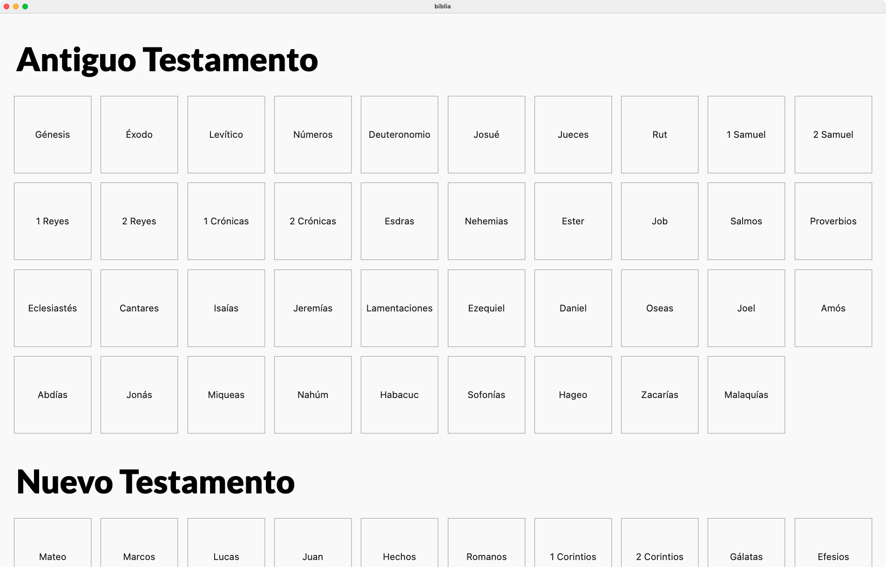
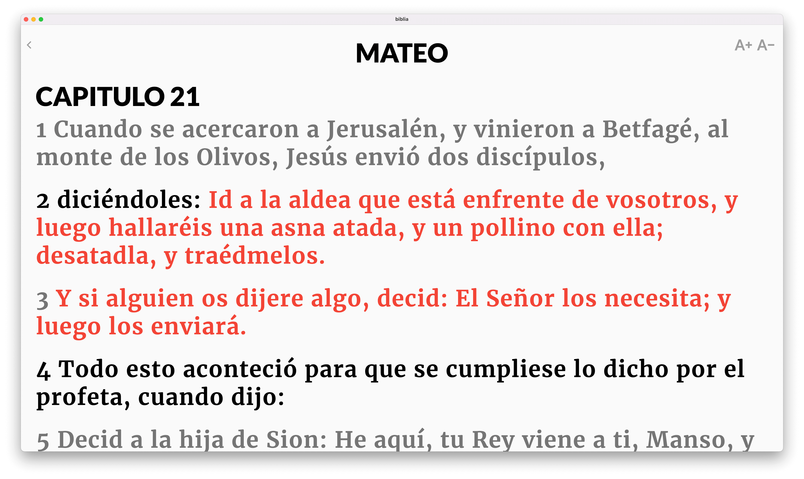

# Biblia de proyectar

Es un diseño super minimalista de la biblia, pensada para ser proyectada en iglesias.

# Roadmap
* [x] Biblia Reina Valera 1960 completa.
* [x] Diseño de interfaz básico.
* [x] Función para aumentar y disminuir el tamaño de la fuente.
* [x] Palabras de Jesús en rojo.
* [ ] Interfaz visual mas atractiva.

Es un diseño super minimalista de la biblia, pensada para ser proyectada en iglesias.

# Screenshot

# Instalación en Windows
